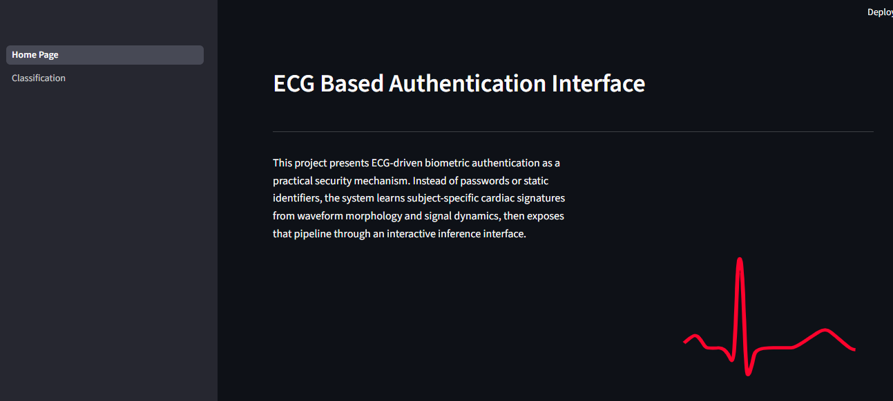
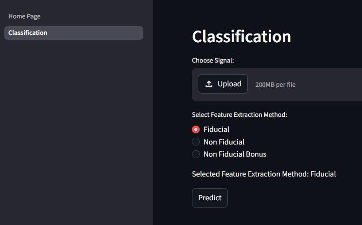

# ECG-Based Authentication Technology

An end-to-end biometric authentication prototype that uses electrocardiogram (ECG) signals as a physiological signature for identity recognition.

This project combines signal preprocessing, fiducial and non-fiducial feature engineering, classical machine learning, and a Streamlit interface for interactive inference on WFDB-formatted ECG records. The result is a compact research-to-demo pipeline: raw waveform in, subject prediction out.

## Why This Project Stands Out

- Treats ECG as a biometric modality rather than a diagnostic-only signal.
- Implements multiple feature families instead of relying on a single representation.
- Bridges algorithm development and deployment with a runnable UI, serialized models, and test signals.
- Shows practical understanding of biosignal engineering: denoising, beat segmentation, fiducial point detection, wavelet features, autocorrelation, and DCT-based descriptors.

## Technical Overview

The system follows a layered pipeline:

1. Acquire ECG records from WFDB-compatible files.
2. Preprocess the waveform using a bandpass filter, differentiation, squaring, and moving-window smoothing.
3. Detect salient fiducial structure such as Q, R, S, P, and T landmarks with onset/offset estimation.
4. Build identity features using three strategies:
   - Fiducial morphology features
   - Non-fiducial autocorrelation plus DCT features
   - Non-fiducial wavelet features around R-peak-centered cardiac segments
5. Classify the subject with trained Random Forest models.
6. Visualize waveform landmarks and extracted representations in a Streamlit app.

## Implemented Feature Strategies

### 1. Fiducial Features

The fiducial pipeline estimates clinically meaningful waveform landmarks:

- Q, R, and S points
- QRS onset and offset
- P peak with onset and offset
- T peak with onset and offset

These landmarks are assembled into structured tabular features that capture beat morphology and temporal relationships.

### 2. Non-Fiducial Features

The non-fiducial branch avoids explicit waveform landmark dependency by transforming the denoised signal through:

- Autocorrelation
- Discrete Cosine Transform (DCT)

This captures subject-specific waveform structure in a compact representation.

### 3. Bonus Non-Fiducial Features

A second non-fiducial method extracts beat-centered windows around detected R peaks and applies wavelet decomposition (`db4`, multi-level). Approximation coefficients are then truncated/padded into fixed-length identity vectors.

## Repository Structure

```text
01.Dataset/                              WFDB-format ECG records used by the project
02.Preprocessing_and_FeaturesExtraction/ Research notebooks and early feature extraction scripts
03.Models/                               Model experimentation scripts
04.GUI/                                  Streamlit application, inference helpers, serialized classifiers
05.Report/                               Report area
06.Test/                                 Sample defined and undefined identity test signals
noised_signal/                           Additional noisy signal examples
basis.pdf                                Project basis/reference document
requirements.txt                         Root Python dependencies
```

## Core Stack

- Python
- NumPy, Pandas, SciPy
- Statsmodels
- PyWavelets
- WFDB
- scikit-learn
- Streamlit
- Matplotlib
- BioSPPy

## Entry Points

These are the files that matter when you want to run or extend the project:

- `04.GUI/Home_Page.py`
  This is the main Streamlit app entrypoint. Run this file with `streamlit run` to launch the interface.
- `04.GUI/pages/Classification.py`
  This is the classification page inside the Streamlit multipage app. It is loaded automatically by Streamlit when the app starts. You usually do not run this file directly.
- `04.GUI/final_project.py`
  This contains the app-facing feature preparation and model helper functions, including dataset loading and feature table assembly.
- `04.GUI/feature_extraction.py`
  This contains the ECG preprocessing and fiducial/non-fiducial feature extraction logic used by the UI.
- `02.Preprocessing_and_FeaturesExtraction/*.ipynb`
  These are research notebooks and exploratory scripts. They document experimentation, but they are not the primary runtime path.
- `03.Models/model.py`
  This is model experimentation code rather than the recommended application entrypoint.

## Setup

This repository now runs successfully with Python `3.13` in a local virtual environment on Windows.

Create and activate a virtual environment from the repository root:

```powershell
python -m venv .venv
.\.venv\Scripts\Activate.ps1
```

Install dependencies:

```powershell
python -m pip install --upgrade pip setuptools wheel
pip install -r requirements.txt
```

## Launching The App

From the repository root, launch the Streamlit app with:

```powershell
.\.venv\Scripts\streamlit.exe run .\04.GUI\Home_Page.py
```

If you prefer to activate the environment first:

```powershell
.\.venv\Scripts\Activate.ps1
streamlit run Home_Page.py
```

Run the second form from inside `04.GUI`, or use the first form from the repository root.

## Interface Preview

The current Streamlit interface looks like this:





## Using The Interface

On the classification page, upload the ECG record files that share the same base name, typically:

- `.hea`
- `.dat`
- `.xyz`

The app then:

- reads the WFDB record,
- preprocesses the signal,
- extracts the selected feature set,
- runs the corresponding classifier,
- displays the predicted subject when confidence crosses the configured threshold,
- and visualizes either fiducial landmarks or transformed feature components.

## Development Notes

- The repository contains research code and app code; the supported runtime path is the Streamlit app in `04.GUI/`.
- The current dependency set includes `peakutils`, which is required indirectly by `biosppy`.
- The bundled classifier `.pkl` files expect `scikit-learn==1.5.2`, so that version is pinned in the requirements files.
- `04.GUI/final_project.py` now resolves dataset paths from the repository root, which makes helper imports work regardless of the shell working directory.

## Models In The UI

The GUI currently loads three serialized Random Forest classifiers:

- `random_forest_classifier_Fid.pkl`
- `random_forest_classifier_nonFid.pkl`
- `random_forest_classifier_nonFidBonus.pkl`

These correspond directly to the three feature extraction modes exposed in the interface.

## What This Demonstrates

This repository is more than a notebook experiment. It demonstrates the ability to:

- translate biosignal theory into an operational feature pipeline,
- compare multiple biometric representations for the same modality,
- package research logic into an inference-ready application,
- and build an applied security prototype around physiological identity signals.

## Notes

- The codebase contains both research-stage scripts and app-facing modules. The Streamlit app in `04.GUI/` is the clearest runnable path.
- Some folders contain exploratory notebooks and generated artifacts kept for reproducibility and reference.
- `basis.pdf` is included as project background material.

## License

This project is distributed under the MIT License. See [LICENSE](LICENSE).
